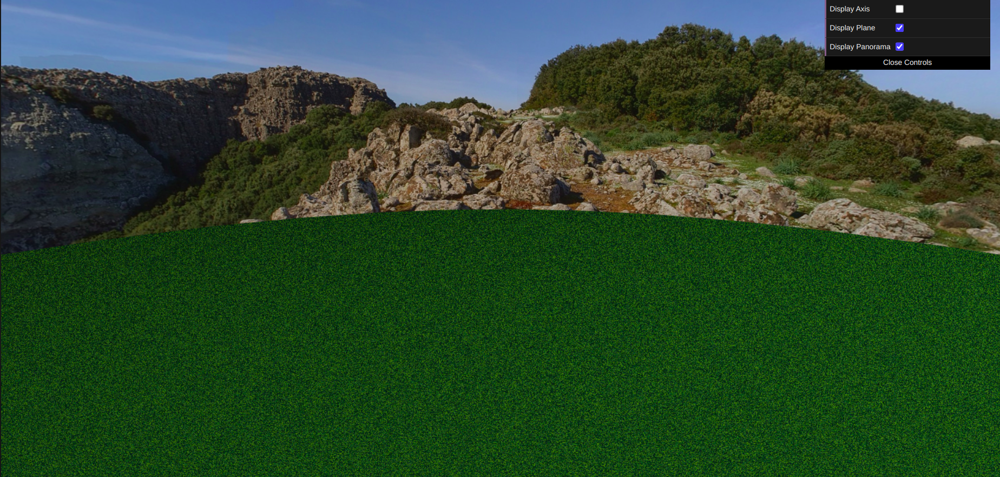
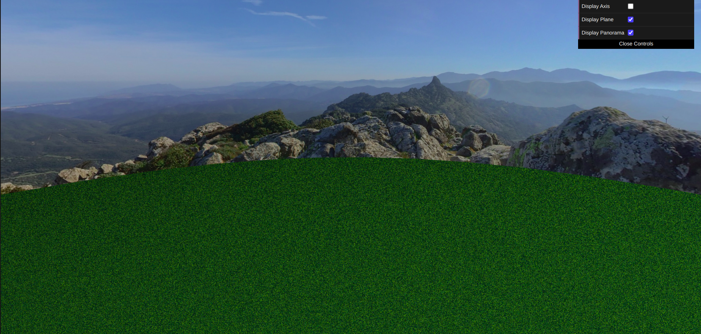
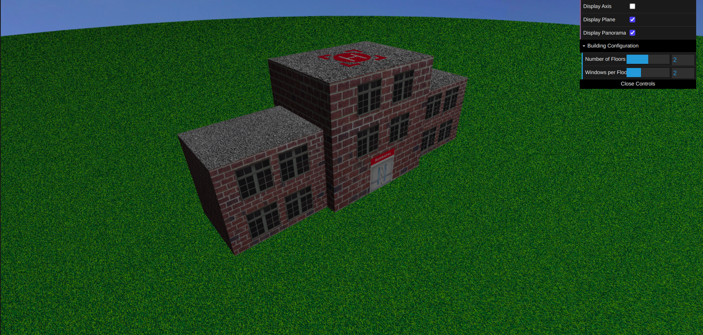
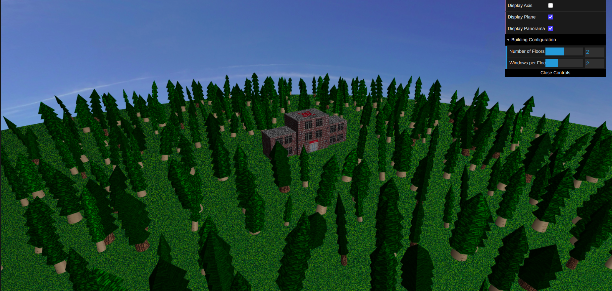
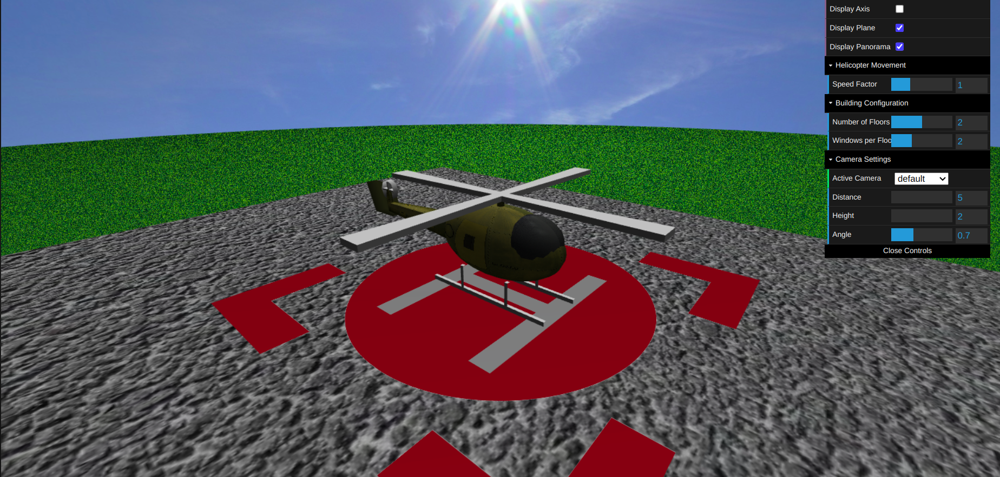
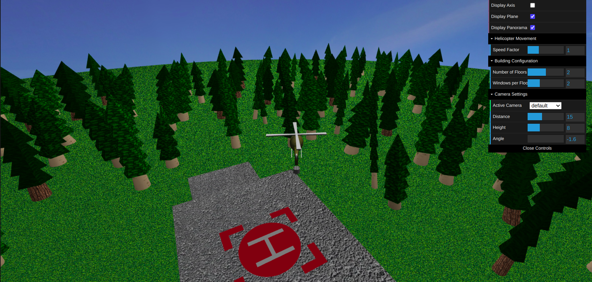
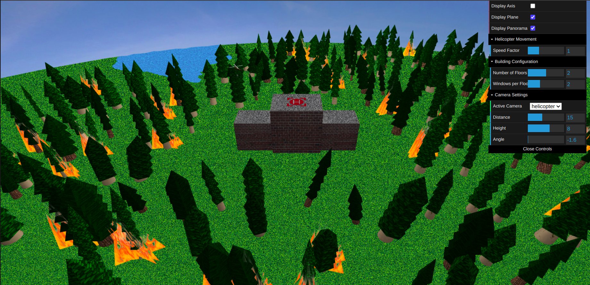
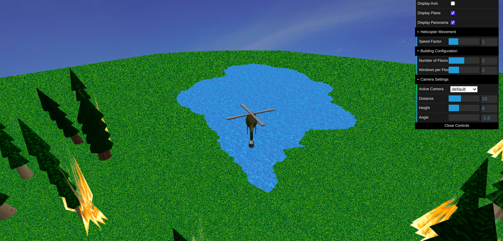

# CG 2024/2025  
**Group T07G10**

| Name           | Student Number |
|----------------|----------------|
| Nelson Neto    | 202108117      |
| Gabriela Silva | 202004443      |

## Helicopter Firefighting Simulation

This project is a 3D simulation of a firefighting helicopter that can collect water from lakes and extinguish forest fires. The scene includes a building complex with a helipad, a forest with randomly generated trees, a lake, and dynamic fire effects.

## How to Run

1. Make sure you have Visual Studio Code installed  
2. Install the **Live Server** extension for VS Code  
3. Open the project folder in VS Code  
4. Right-click on `index.html` and select **"Open with Live Server"**  
5. The simulation will open in your default web browser

---

## Helicopter Controls

The helicopter can be controlled using the following keys:

- `W` - Move forward  
- `S` - Move backward  
- `A` - Turn left  
- `D` - Turn right  
- `P` - Take off / Ascend from water after collecting  
- `L` - Land on helipad / Descend to water for collection  
- `O` - Drop water (when flying over fires with water in bucket)  
- `R` - Reset helicopter position to helipad  
- `C` - Toggle between default camera and helicopter-following camera  

---

## Game Objective

Your objective is to extinguish forest fires that appear randomly throughout the scene. To accomplish this:

1. Take off from the helipad using the `P` key  
2. Fly to a lake (blue areas on the ground)  
3. Hover over the lake and press `L` to descend and collect water  
4. Once the bucket is in the water, press `P` to ascend with a full water bucket  
5. Fly over active fires (visible as animated flame effects)  
6. Press `O` to drop water on the fires  
7. Repeat as needed to extinguish all fires  
8. Return to the helipad by pressing `L` when over the building complex

---

## Development Progress

### 🌌 Sky Sphere

  

---

### 🏢 Fire Station Building

---

### 🌲 Trees and Forest

---

### 🚁 Helicopter

  

---

### 💧🔥 Water and Fire

---

### 🧪 Additional Features

