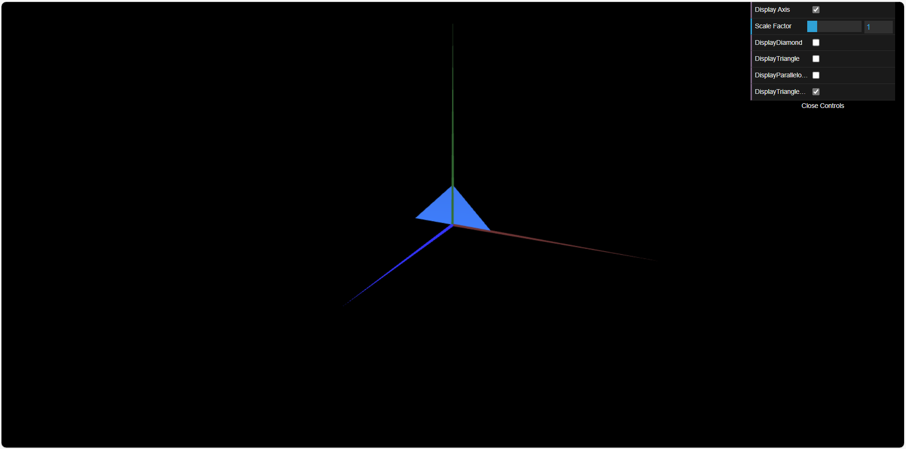
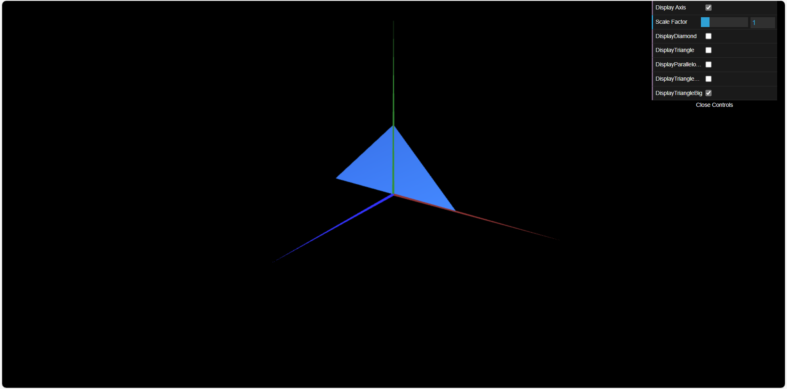

# CG 2024/2025

## Group T0xG0y

## TP 1 Notes

(add your main observations/remarks about your experiments here, in a bulleted list, and remove this line. Some examples below)

- In exercise 1 we observed X
- In exercise 2 we had difficulties in Y

- In the first exercise, we generated the two required geometric figures: a triangle and a parallelogram. The exercise sheet asked for the parallelogram to be double-sided. We initially struggled with this but quickly realized that it was simply a matter of reversing the order of the indices.

- In the second exercise, we simply were asked to reproduce the two figures presented to us: triangle big and triangle small.

Here are the results:

