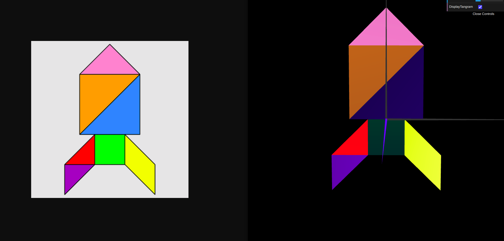
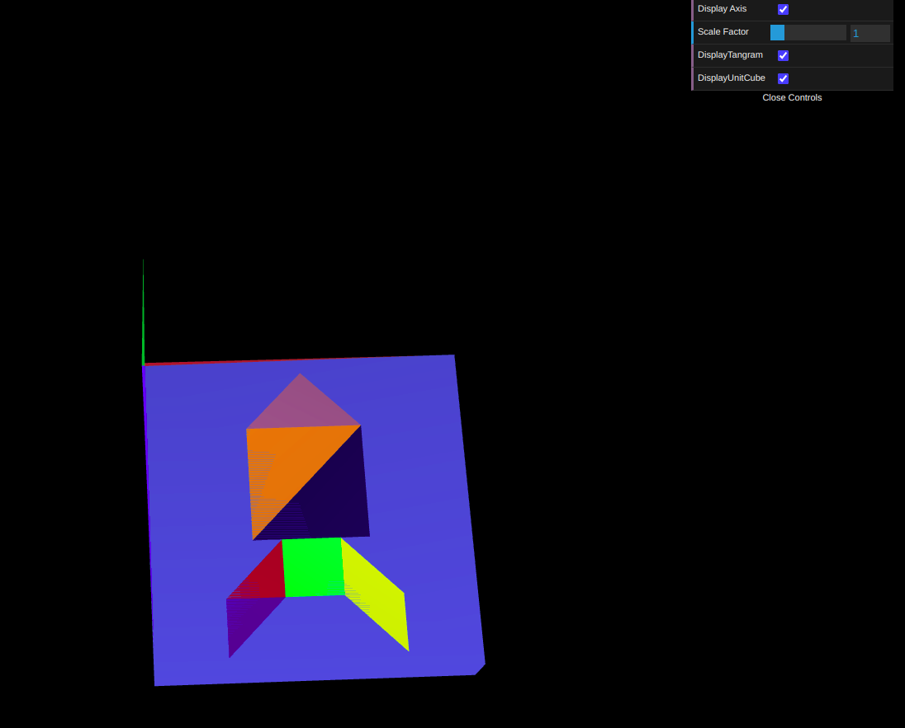
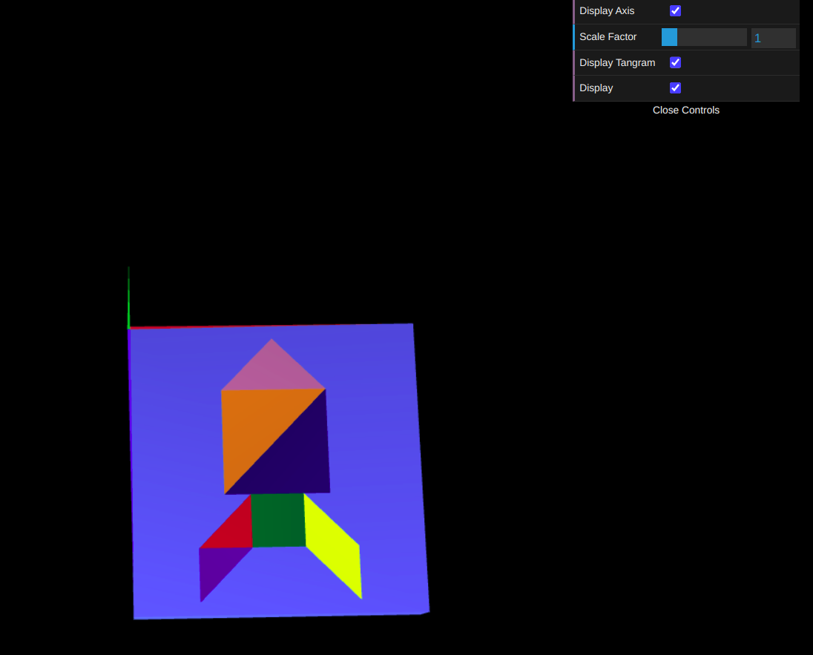

# CG 2024/2025

## Group t07g10

## TP 2 Notes

- In exercise 1, we utilized the figures created in TP1 to assemble a single `MyTangram.js` through 3D graphical transformations. The most challenging aspect was applying the transformations to the pieces, as the order of transformations is crucial. An incorrect initial order of transformations led to significant difficulties in aligning the figures.

Figure 1: Tangram

- In exercise 2, we created a unit cube centered at the origin of the reference frame. We specified the coordinates of the vertices and triangles that constitute the cube's mesh, ensuring that all external faces of the cube were visible. We combined the two previous figures and, after rotating them around the X-axis and translating them to the correct position, we managed to align them parallel to the XZ plane.

Figure 2: MyUnitCube

- In exercise 3, we constructed another unit cube, this time using a square plane as a base. Through transformations, the cube was built. This approach was simpler to implement because it is modular.

Figure 3: Tangram and UnitCubeQuad
