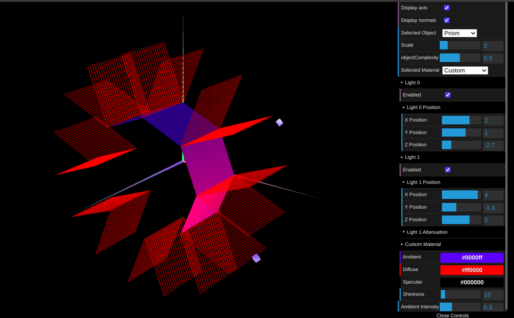

# CG 2024/2025

## Group T07G10

## TP 3 Notes

- In the first exercise, we generated the necessary normal vectors for the shapes created in TP1 and TP2 to ensure that the lighting behaved correctly based on the light's angle of incidence and the viewing angle. Additionally, we designed a wood-textured material with a low specular component.

Figure 1: Wood cube

Continuing with exercise 1, we applied various materials with a high specular component to the figures that make up the tangram.

Figure 2: Tangram Materials

- In exercise 2, we built a prism with a variable number of sides and complexity. The most challenging part was implementing the most efficient algorithm possible to create vertices, describe the triangle mesh, and create normalized normals at each vertex.

Figure 3: Prism

- In exercise 3, the normals were placed perpendicular to each edge. Thus, we reduced the number of vertices and normals to calculate. As expected, the transitions of lighting at the edges were smoothed, became less apparent, and gave a curved appearance to the surface of the previous prism.

Figure 4: "Cylinder"
