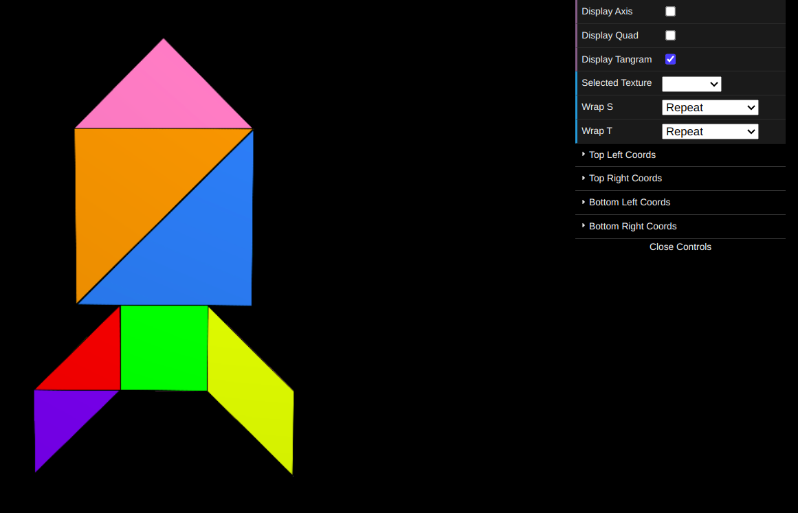
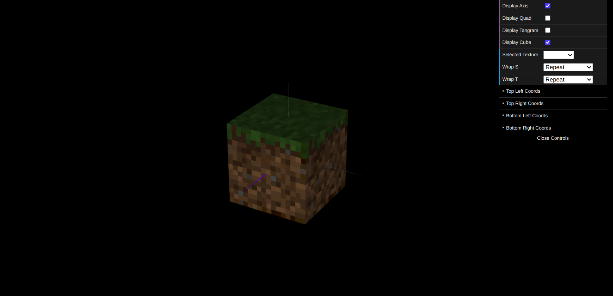

# CG 2024/2025

## Group T07G10

## TP 4 Notes

- In exercise 1, we applied textures to the Tangram pieces. For each piece, we defined texture coordinates that mapped the corresponding section of the `tangram.png` image onto the piece. This required careful alignment of the vertices with the edges of the image. The most challenging part was determining the correct texture coordinates for each vertex, which involved analyzing the image and mapping the S and T axes to the vertices of the shapes.

Figure 1: Textured Tangram

- In exercise 2, we updated the `MyUnitCubeQuad` class to allow the application of six different textures, one for each face of the cube. We created an instance of the cube using the textures `mineSide.png` for the lateral faces, `mineTop.png` for the top face, and `mineBottom.png` for the bottom face. Additionally, we adjusted the texture filtering mode to `NEAREST` to improve the visual clarity of the textures, as they were originally low-resolution (16x16 pixels).

Figure 2: Textured UnitCubeQuad
